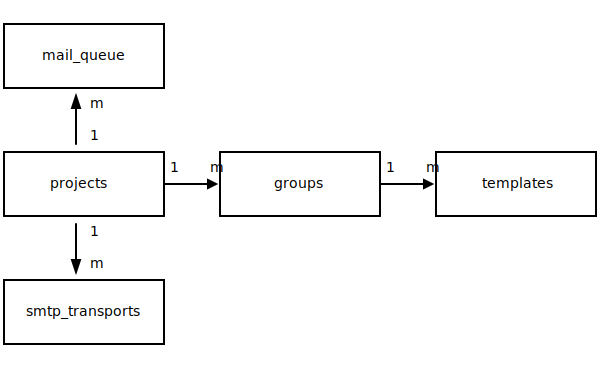

# Architecture

This document describes the architecture of the Squishy Mailer Lite system. For details on how to use the system, see the [README](../README.md) document.

## Overview

The architecture of the system is based on the following components:




- **projects** - A project is the highest level of organisation in the system. A project can have multiple _transports_. A project can be used to group email _templates_ based on a common theme or purpose.

- **groups** - A group is a collection of email _templates_. A group can be used to group email templates based on a common theme or purpose. There are many groups in a project.

- **templates** - A template is a predefined email that can be used to send emails. It can accept arguments that can be used to customise the email. There are many templates in a group. A template is can be assisgned to a single group. A template is unique within a project.

- **smtp_transports** - A transport is a method of sending emails. A project can have multiple transports. A transport can be used to send emails using different methods, such as SMTP, AWS SES, SendGrid, or Mailgun, although the system only supports SMTP at the moment. There is a common interface `email.Sender` for all transports, which allows for easy addition of new transports. A project can contain many transports and one transport is designated the _active transport_ (not shown in the diagram) for the project.

- **mail_queue** - The mail queue is a table that stores the emails that are to be sent. It stores the email details such as the sender, recipient, subject, and body. It also stores the status of the email, such as whether it has been sent or not.


## Appendix
### Text Diagrams used to generate the ER Diagram above
```text
+-------------------+
|                   |
|    "mail_queue"   |
|                   |
+-------------------+
         ^ m
         |
         | 1
+-------------------+      +-------------------+      +-------------------+
|                   |1    m|                   |1    m|                   |
|     projects      |----->|      groups       |----->|     templates     |
|                   |      |                   |      |                   |
+-------------------+      +-------------------+      +-------------------+
         | 1
         |
         v m
+-------------------+
|                   |
|  "smtp_transports"|
|                   |
+-------------------+
```
